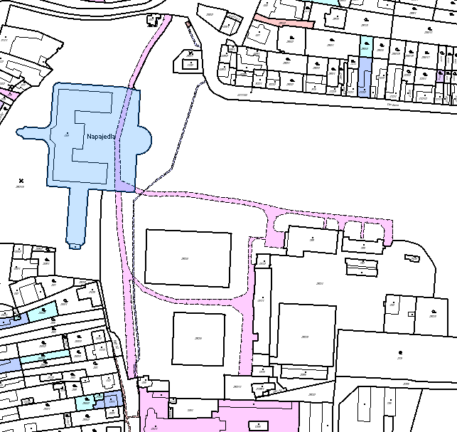
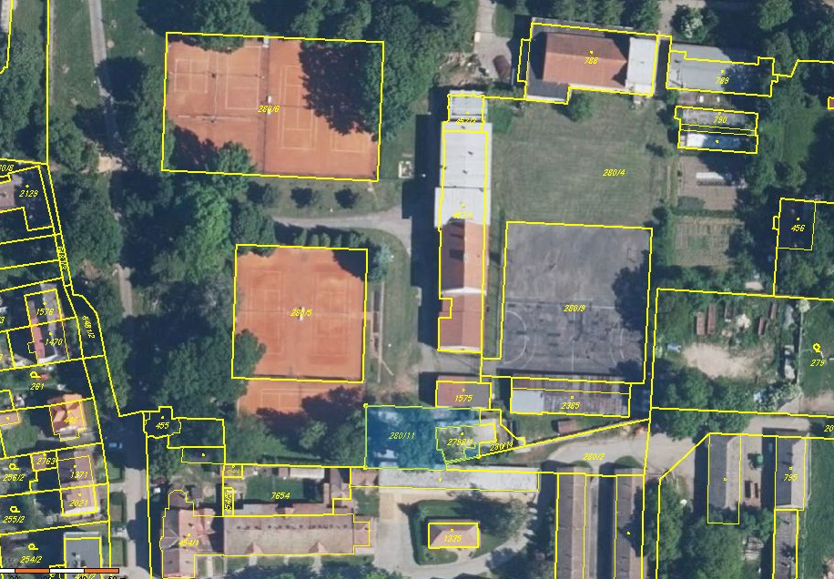

Zpřístupnění zámeckého parku v Napajedlích
==========================================

Popis projektu
--------------

Do svého uzavření byl zámecký park v Napajedlích výjimečným místem, kde s potěšením
trávili volný čas lidé všech generací ze všech částí Napajedel. Účelem tohoto
projektu je prozkoumat možnosti, které by občanům města tento prostor znovu zpřístupnily.

Navrhovaný způsob, jak navrátit původní stav parku, je koupit park zpět a nedopustit,
aby jsme o park znovu přišli. Městské vlastnictví by mohlo bý řešením problému, ale
nutně jím být nemusí. Pokud existuje způsob, kterým by EU nebo ČR mohly přispět k řešení
našeho problému, neměli bychom jej přehlédnout.

Problém má dvě části:

1. Jak získat park zpět.
2. Jak zabránit jeho ztrátě v budoucnu.

Druhou část musíme vyřešit před realizací první části, protože pokud bychom se
do toho vrhli a vše, co máme, dali za park, nebo dokonce za zámek, ten by se
zadlužil a šel do exekuce, bylo by to celé k ničemu.

Dle materiálu [1] má Zámek asi 8000 návštěvníků dle sdělení Zámku Napajedla, s.r.o.
(s. 16). Toto číslo nepovažuji za věrohodné, ovšem při 500 Kč na návštěvníka
to dává 4M Kč ročně zisk. Otázka je, jaké má zámek náklady. Stejný materiál
doslova uvádí mezi slabými stránkami města Napajedel (s. 43):

* Nízká aktivita občanů se zájmem o dění ve městě, špatné mezilidské vztahy
* Životní prostředí
* Zvýšená doprava přes město, nadměrný průjezd městem, hluková zátěž
* Omezený průchod zámeckým parkem z důvodu špatných vztahů mezi vlastníkem zámku a zástupci města

Na s. 53 je jako součást strategického cíle III. *Rozvoj cestovního ruchu rodinného typu*
v opatření 3.2 *Městké kulturní centrum* eveden aktivita 3.2.d *Zajistit udržitelnost
stávajících kulturních objektů města v zámeckém areálu*. Problém ovšem už není
jinde rozveden. Na předposlední s. 70 je uvedeno, že Napajedla hospodaří se zhruba
vyrovnaným rozpočtem 100M Kč. Na poslední straně si můžete prohlédnout do čeho
jsou tyto peníze investovány.

Myslím si, že navrátit park do původního provozu by hodně pomohlo ohledně
těchto slabých stránek.

[1] PROGRAM ROZVOJE MĚSTA NAPAJEDLA NA OBDOBÍ 2013 – 2022 (listopad 2013)
http://www.napajedla.cz/uploads/pdf/program-rozvoje-mesta-napajedla.pdf

Cíle projektu
-------------

### Průchod
Umožnit bezpečný veřejný průchod přes park 24/7, tzn. jižní brána, severní brána
a východní branka areálu stále otevřeny.

### Rekreace
Umožnit rekreaci návštěvníků zámeckého parku: louka a lavičky v areálu by měly
být přístupné a v dobrém stavu.

### Klub
Otevřít Klub kultury v původním režimu: nekuřácký bufet, salonek a divadlo.

### Udržení
Zajistit, že park zůstane průchozí, otevřený a bezpečný a především nedopustit
současnou nebo horší situaci. Udržet park náš (=města?), nezadlužený a nechátrající.

Základní informace
------------------

#### Zámek Napajedla

##### Právní postavení Zámku

Výřez z územního plánu se zámeckým areálem:

Po rozklikuntí klikněte na "Raw" pro plné rozlišení. Zdroj: http://www.napajedla.cz/cs/uzemni-plan

Dle územního plánu je tedy stavba zámku *nemovitá kulturní památka*, chodníky v areálu
*veřejná prostranství*, zelené plochy jsou *zeleň sídelní - veřejná*, hřiště jsou
*plochy pro sport a rekreaci*, klub a budova za klubem jsou *plochy technického vybavení*,
plocha okolo házenkářského hřiště je *plocha občanské vybavenosti* a konečně severní
příjezdová cesta je *silnicí*. Co se smí dít se kterým územím je popsáno v Obecně závazná vyhlášce
č. 6/2002 o závazných částech územního plánu města Napajedla (dále jen OZV), která je dostupná zde:

http://napajedla.cz/uploads/doc/ozv-c-6-2002-o-zavaznych-castek-upn.doc

V této vyhlášce je pro každý typ plochy napsáno přípustné, podmíněné a nepřípustné využití.
V OZV je to popsáno takto:

###### Přípustné

Tyto činnosti, stavby a zařízení  tvoří nebo vhodně doplňují dominantní funkci v území a jsou realizovatelné bez dalšího omezení.

###### Podmíněné

Tyto činnost, stavby a zařízení jsou realizovatelné po individuálním posouzení povolujících orgánů územního řízení, vzhledem
k tomu, že by v území mohly způsobovat kolizi s okolními funkcemi. Při povolení je třeba být v souladu s příslušným
regulativem a příslušnou právní úpravou a současně se v daném území nenabízí vhodnější alternativní řešení.
Podmíněné funkce a činnosti přípustné v jednotlivých funkčních plochách nesmí překročit svým rozsahem hlavní funkci.

###### Nepřípustné

Tyto činnosti, stavby a zařízení jsou nerealizovatelné za žádných podmínek.

Nás zajímá hlavně *zeleň sídelní - veřejná* a *veřejná prostranství*. V OZV jsou následující sekce:

###### Sídelní zeleň 

Přestavují plochy zeleně důležité pro vzhled města a jeho místních částí, která se nachází
v zastavěném území, zeleň uličních prostorů, veřejných prostranství, náměstí, parků, lesoparků atd.

Přípustné
- sadově upravené plochy zeleně

Podmíněné
- plochy pro sport
- stavby a zařízení pro odpočinek
- stavby sloužící dopravě pěší, cyklistické, parkoviště
- stavby technické vybavenosti

Nepřípustné
- stavby pro bydlení
- stavby občanské vybavenosti
- stavby pro průmyslovou a zemědělskou výrobu, skladové areály
- čerpací stanice PHM

###### Veřejná prostranství 

Plochy nacházející se v centrální části města, zahrnující převážně plochy náměstí a přilehlé navazující
prostory uliční, které jsou dopravně zklidněny s upřednostněním pěší dopravy. Plochy sloužící
krátkodobému oddychu,které jsou reprezentativně upraveny.

Přípustné
- komunikace a plochy sloužící pěší dopravě
- veřejná zeleň
- městský mobiliář

Podmíněné
- stavby a zařízení pro automobilovou dopravu
- krátkodobé prodejní stánky
- informační a reklamní poutače 
- stavby a zařízení technické vybavenosti
- prodejní stánky,buňky

Nepřípustné
- stavby pro bydlení, občanskou vybavenost, průmysl, zemědělství, sport a rekreaci, technickou vybavenost
- velkoplošná reklamní zařízení

Legenda k územnímu plánu pro úplnost následuje.

Stavební parcela číslo 459 je stavba zámku a nádvoří a číslo není na mapce výše, bylo ovšem možné
ji vyhledat v katastru nemovitostí. Dle katastru jsou zde aplikovány dva způsoby ochrany nemovitostí:

* menší chráněné území
* nemovitá kulturní památka

Dále jsou zde zapsány čtyři omezení vlastnického práva:

* Předkupní právo
* Věcné břemeno chůze a jízdy
* Zákaz zatížení
* Zástavní právo smluvní

Věcné břemeno je v katastru zaznačeno takto.

##### Vlastnická práva

Vlastnické právo na parcelu se Zámkem, tzn. parcelu 459, má Zámek Napajedla s.r.o., Zámecká 265,
76361 Napajedla (dále jen Zámek s.r.o). Zámku s.r.o. dále patří parcela 455 (dům u jižní brány),
460 (dům u severní brány), parcela 280/7 (kousek parku okolo transformátoru u severní brány),
280/11 (kulturní památka u tenisového hřiště), 280/15 (zeleň ve svahu pod zámkem a severní
příjezdová silnice), 2034/31 (zahrádka u východní branky) a 1722 (technická budova
poblíž severní brány).

Vlastnické právo na parcelu 280/1, tedy na park, jak jej známe, má Gajdošík Eva Mgr.,
Chmelnice 853, 76361 Napajedla, dále vlastní také parcelu 3171 (trafostanice u severní brány).

Klub (parcela 788) a budova za ním (789) je Města Napajedla. Hřiště 280/5, 280/6 a 280/9
jsou majetkem TJ Fatra Slavia Napajedla, Komenského 101, 76361 Napajedla (dále jen TJ Fatra Slavia)

Zdroj: http://nahlizenidokn.cuzk.cz

Zámek je chráněná nemovitá kulturní památka evidována pod číslem 2001 jako "zámek č.p. 265 s areálem"
dle Obecně závazné vyhlášky č. 6/2002 o závazných částech územního plánu města Napajedla.

##### Cena zámku

V Napajedelských novinách 7/2014 se hovoří o ceně 500 Kč/m² za park.

Dále se prodává celý areál zde, cena je 10M € = 275M Kč.

http://www.europeanrealestateads.com/listing/chateaux-napajedla--888.html

Prodejce Zdeněk Mikel zároveň prodává i GAMEX CZ, jehož jednatelkou je Gajdošík
a kontaktní osobou je osoba jménem Stanislav Gajdošík. Inzerat je z 2012-06-28.

### Napajedla

Současný odhad lidí ochotných zapojit se do projektu je 10 až 2000. Velká otázka
ovšem je, kolik budou ochotni investovat. K následujícím informacím by se hodilo
doplnit věkovou strukturu obyvatel.

#### Počet občanů ČR v Napajedlích k lednu 2015

* Muži            3553
* Muži 15+        3070
* Ženy            3710
* Ženy 15+        3239
* Celkem          7263
* Celkem 15+      6309

zdroj: MVČR

#### Informativní počet cizinců s realizovaným pobytem v Napajedlích k 1.1.2015

* Muži              69
* Muži 15+          64
* Ženy              35
* Ženy 15+          32
* Trvalý pobyt      55
* Přechodný pobyt   49
* Celkem           104
* Celkem 15+        96

zdroj: MVČR, (nenahrazuje data ČSÚ)

#### Cena projektů Města Napajedel

Vyrovnaný rozpočet je ca 100M celkem. Typické výdaje na školy apod. jsou po ca několika milionech.

##### Naše Napajedla - město pro život, revitalizace veřejných ploch a komunikací v městské památkové zóně - 3. etapa

* Celkové náklady:  23,9 mil. Kč vč. DPH
* Dotace z evrop. fondu pro regionální rozvoj: 15,1 mil. Kč vč. DPH
* Vlastní zdroje města:  8,8 mil. Kč vč. DPH

Dostupné informace
------------------

Pěkně shrnuto na Wikipedii, Centauriho bloku, a v Napajedelských novinách 7/2010 a 7/2014.

http://cs.wikipedia.org/wiki/Napajedla_%28z%C3%A1mek%29

Další postup
------------

Nepochybně jsme teď ve fázi zjišťování informací a přípravy detailního plánu postupu.

Parcely 280/1 a 280/15, tj. park, všechny čtyři brány (o horní si nejsem jist) a cesta skrz
při potenciální ceně 500 Kč/m² z Napajedelských novin 7/2014:

(71178 + 10578) m² * 500 Kč/m² = 40 878 000 Kč

1. To je dost. Dalo by se to snížit?
2. Gajdošík nepochybně bude namítat možností výtržností a vandalismu. To by mohl vyřešit
policajt, který bude procházet parkem, nikoliv stále, ale v rámci obhlídky města. Jak je
toto problém?
3. Je už čas začít s tím seznamovat více lidí a zeptat se Gajdošík, jaké by byly podmínky
prodeje (provozní řád apod.)?
