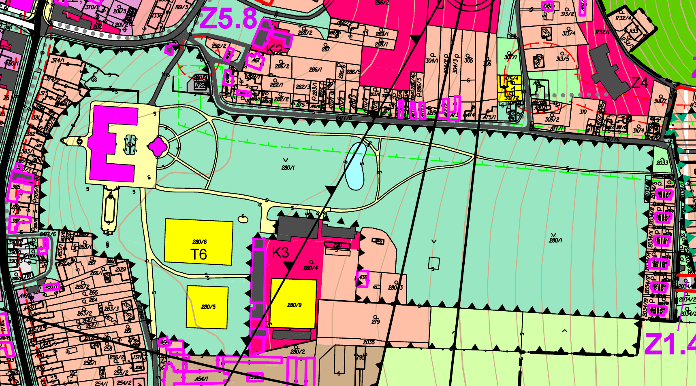
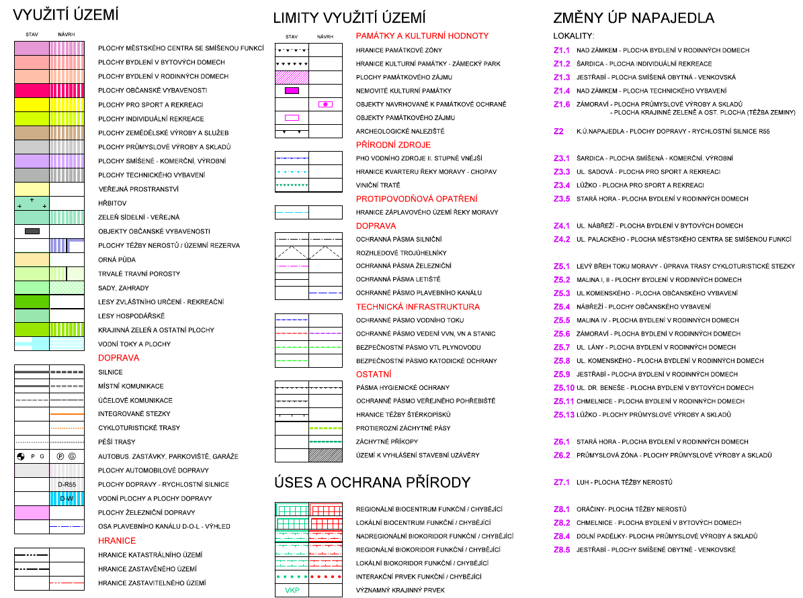
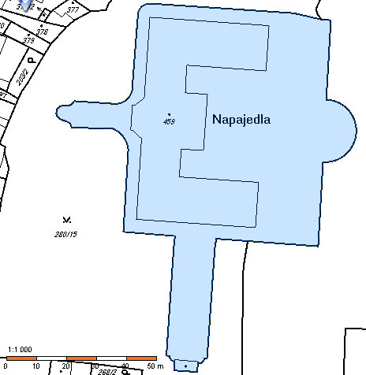
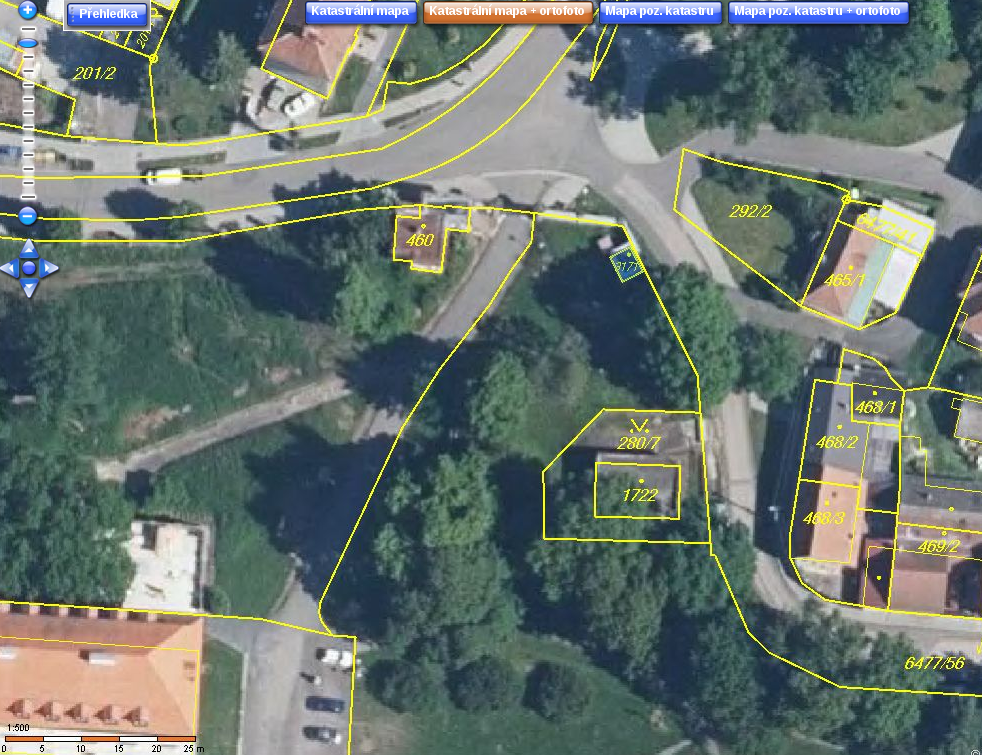
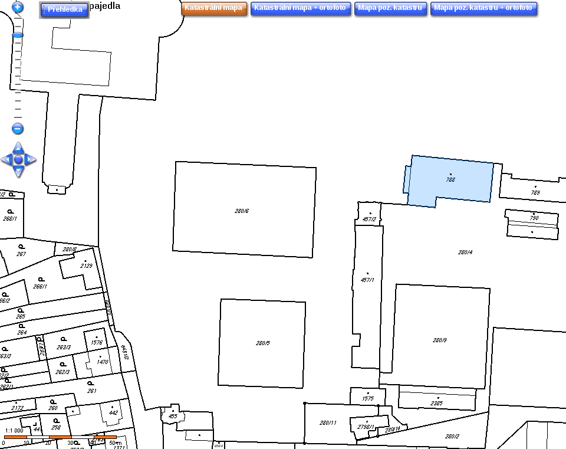

Zpřístupnění zámeckého parku v Napajedlích
==========================================

Popis projektu
--------------

Pravděpodobně jediný způsob, jak navrátit původní stav parku, je koupit to celé
zpět a nedopustit, aby jsme o areál znovu přišli. Státní vlastnictví by podle
mého názoru jen odložilo problém, ale pokud existuje způsob, kterým by EU nebo
ČR mohly přispět k řešení našeho problému, neměli bychom jej přehlédnout.

Problém má dvě části:

1. Jak získat park zpět.
2. Jak zabránit jeho ztrátě v budoucnu.

Druhou část musíme vyřešit před realizací první části, protože pokud bychom se
do toho vrhli a vše, co máme, dali za zámek, ten by se zadlužil a šel do exekuce,
bylo by to celé k ničemu.

Nejprve je třeba zjistit, kolik by stálo celý areál
koupit a kolik by stálo jej udržovat. Následně podle objemu prostředků, které
budou třeba na pořízení a provoz, vymyslíme konkrétní právní formu pro naše potřeby
a nějaký ekonomicko-provozní plán. S tím seznámíme veřejnost, vyhlásíme, co je třeba
a pak už bude vše záležet, zda najdeme dostatečný počet lidí s dostatkem peněz.

Cíle projektu
-------------

### Průchod
Umožnit bezpečný veřejný průchod přes park 24/7, tzn. jižní brána, severní brána
a východní branka areálu stále otevřeny.

### Rekreace
Umožnit rekreaci návštěvníků zámeckého parku: louka a lavičky v areálu by měly
být přístupné a v dobrém stavu.

### Klub
Otevřít Klub kultury v původním režimu: nekuřácký bufet, salonek a divadlo.

### Udržení
Zajistit, že park zůstane průchozí, otevřený a bezpečný a především nedopustit
současnou nebo horší situaci. Udržet zámek a park náš, nezadlužený a nechátrající.

Postup
------

* Zjistit, jaká je situace.
* Vymyslet, jak udržet zamýšlený právní subjekt nezadlužený a areál nechátrající
* Složit se
* Otevřít park a klub
* Udržovat vše bezpečné, uklizené a fungující a sledovat ekonomickou situaci
založeného právního subjektu

Základní informace
------------------

#### Zámek

##### Právní postavení Zámku

Chráněná nemovitá kulturní památka evidována pod číslem 2001 jako "zámek č.p. 265 s areálem"
* Zdroj: Obecně závazná vyhláška č. 6/2002 o závazných částech územního plánu města Napajedla

Výřez z územního plánu zde:

Po rozklikuntí klikněte na "Raw" pro plné rozlišení. Zdroj: http://www.napajedla.cz/cs/uzemni-plan

Legenda k územnímu plánu:

Dle územního plánu je tedy stavba zámku *nemovitá kulturní památka*, chodníky v areálu
*veřejná prostranství*, zelené plochy jsou *zeleň sídelní - veřejná*, hřiště jsou
*plochy pro sport a rekreaci*, klub a budova za klubem jsou *plochy technického vybavení*,
plocha okolo házenkářského hřiště je *plocha technického hřiště* a konečně severní
příjezdová cesta je *silnicí*.

Stavební parcela číslo 459 je stavba zámku a nádvoří a číslo není na mapce, bylo ovšem možné
ji vyhledat v katastru nemovitostí). Dle katastru jsou zde dva způsoby ochrany nemovitostí:

* menší chráněné území
* nemovitá kulturní památka

Dále jsou zde zapsány čtyři omezení vlastnického práva:

* Předkupní právo
* Věcné břemeno chůze a jízdy
* Zákaz zatížení
* Zástavní právo smluvní

Vlastnické právo na zámek, tzn. parcelu 459, má Zámek Napajedla s.r.o., Zámecká 265,
76361 Napajedla (dále jen Zámek s.r.o). Zámku s.r.o. dále patří parcela 455 (dům u jižní brány),
parcela 280/7, 280/11, 280/15, 2034/31 a 1722.

Vlastnické právo na parcelu 280/1, tedy na park, jak jej známe, má Gajdošík Eva Mgr.,
Chmelnice 853, 76361 Napajedla (dále jen Bathory). Bathory dále vlastní parcelu 3171,
co to je?

Klub (parcela 788) a budova za ním (789) je Města Napajedla. Hřiště 280/6, 280/7 a 280/9
jsou majetkem TJ Fatra Slavia Napajedla, Komenského 101, 76361 Napajedla (dále jen TJ Fatra Slavia)

Zdroj: http://nahlizenidokn.cuzk.cz

##### Cena zámku

Prodává se zde, cena je pekelných 10M € = 275M Kč = 275 000 Kč * 1000 lidí.

http://www.europeanrealestateads.com/listing/chateaux-napajedla--888.html

Toto pravděpodobně bude skutečně od hraběnky, protože prodejce Zdeněk Mikel zároveň
prodává i GAMEX CZ, jehož jednatelkou je hraběnka a kontaktní osobou je kdosi jménem
Stanislav Gajdošík. GAMEX CZ je v likvidaci od 1.1.2015.

<!--
Viz:
http://rejstrik-firem.kurzy.cz/60708611/gamex-cz-sro-v-likvidaci/
http://www.edb.cz/firma-137626-gamex-cz-napajedla
-->

Inzerat je z 2012-06-28, ale datum inzeratu byl skryt, ale lze jej najít
ve zdrojovém kódu webové stránky.

### Napajedla

Současný odhad lidí ochotných zapojit se do projektu je 10 až 2000. Velká otázka
ovšem je, kolik budou ochotni investovat.

<!-- TODO:
* Zestručnit tuto kapitolu, data do samostatného souboru a sem jen odkaz -->

#### Počet občanů ČR v Napajedlích k lednu 2015

* Muži            3553
* Muži 15+        3070
* Ženy            3710
* Ženy 15+        3239
* Celkem          7263
* Celkem 15+      6309

zdroj: MVČR

#### Informativní počet cizinců s realizovaným pobytem v Napajedlích k 1.1.2015

* Muži              69
* Muži 15+          64
* Ženy              35
* Ženy 15+          32
* Trvalý pobyt      55
* Přechodný pobyt   49
* Celkem           104
* Celkem 15+        96

zdroj: MVČR, (nenahrazuje data ČSÚ)

Detailní plán postupu
---------------------

